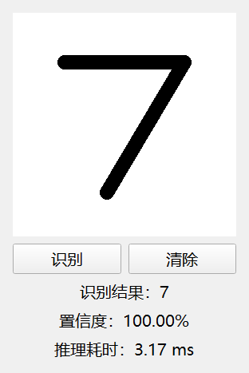

# Handwritten Digit Recognition

An offline MNIST desktop application with a shared PyTorch inference core,
reproducible evaluation, and a PyQt5 drawing canvas.

## 中文说明

一个可复现评测、可打包发布的手写数字识别离线桌面应用。
该版本不包含后端服务，聚焦从模型训练到 Windows 客户端交付的完整闭环。



## 技术栈

- Python 3.11、PyTorch、torchvision
- PyQt5、Pillow、NumPy
- pytest、Ruff、GitHub Actions、PyInstaller

## 架构与数据流

```text
MNIST -> 固定训练/验证划分 -> CNN 训练 -> 最佳验证权重 -> 最终测试与评测报告
PyQt 画板 -> 共享图像预处理 -> Predictor -> 数字、置信度、推理耗时
```

`src/digit_recognizer/core` 统一维护模型、预处理、路径解析和推理；
训练与 PyQt 客户端复用同一核心，避免算法逻辑漂移。

## 源码安装与启动

```powershell
python -m venv .venv
.\.venv\Scripts\Activate.ps1
python -m pip install -e ".[desktop]"
digit-desktop
```

应用完全离线运行；在 280×280 画板中书写一个数字，点击“识别”即可查看预测、置信度和耗时。

## 训练与质量检查

```powershell
python -m pip install -e ".[desktop,train,dev]"
python scripts/train.py --device auto --epochs 15
python -m pytest -v
python -m ruff check .
```

训练固定随机种子 `42`，从 MNIST 训练集划出独立验证集，
只按验证集选择最佳权重，测试集仅用于最终评测。

## 真实评测结果

| 指标 | 结果 |
| --- | ---: |
| MNIST 测试准确率 | 99.57% |
| 最佳验证准确率 | 99.66% |
| CPU 单样本延迟 median | 2.63 ms |
| CPU 单样本延迟 P95 | 3.38 ms |
| 模型参数量 | 585,578 |

评测数字由 `reports/metrics.json` 与 `models/model_metadata.json` 自动同步。
完整图表见[训练曲线](reports/training_curves.png)和
[混淆矩阵](reports/confusion_matrix.png)。

## Windows Release

版本标签会触发 GitHub Actions 构建 Windows onedir 压缩包；
发布后可在仓库的
[Releases](https://github.com/xushen666/Handwritten-digit-recognition/releases) 页面下载。

## 项目来源与职责

项目源于课程设计小组作业，公开版本由本人主导完成核心实现、工程化重构、
模型复训评测和交付整理。

## 局限

当前模型只面向 MNIST 风格的单数字分类，是教学与工程展示项目，
并非生产级 OCR，不适用于多字符、复杂背景或通用文档识别。

## License

本项目采用 [MIT License](LICENSE)。
